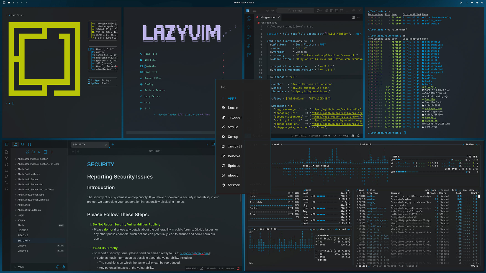

# Neo Sploosh Theme



**Neo Sploosh** is a simple theme that combines cool blues, soft grays, and bright yellow accents for a clean, quick-feeling look. The name comes from the [_Neo Sploosh-o-matic_](https://splatoonwiki.org/wiki/Neo_Sploosh-o-matic), the Splatoon 3 weapon that inspired the palette.


## Install

```sh
omarchy-theme-install https://github.com/monoooki/omarchy-neo-sploosh-theme
```

Companion themes for other editors are also available:

- VS Code: https://github.com/monoooki/vscode-neo-sploosh-theme
- Obsidian: https://github.com/monoooki/obsidian-neo-sploosh-theme

## License

Released under the MIT license.

Wallpaper imagery is licensed via the [Unsplash License](https://unsplash.com/license) and uses photos by
[Aedrian Salazar](https://unsplash.com/photos/03r2PBffuCk),
[Luca Nicoletti](https://unsplash.com/photos/fkA-hGDs-Y8),
[Bruno Figueiredo](https://unsplash.com/photos/uoteo7uO5OI),
[Murat Onder](https://unsplash.com/photos/EWDCeCUz8Ho),
[Marc Newberry](https://unsplash.com/photos/xKnUnPEUiWA),
and [Jahanzeb Ahsan](https://unsplash.com/photos/pVzRwZJPK-M) on Unsplash.


<a href="https://ko-fi.com/monoooki" target="_blank"></a>
