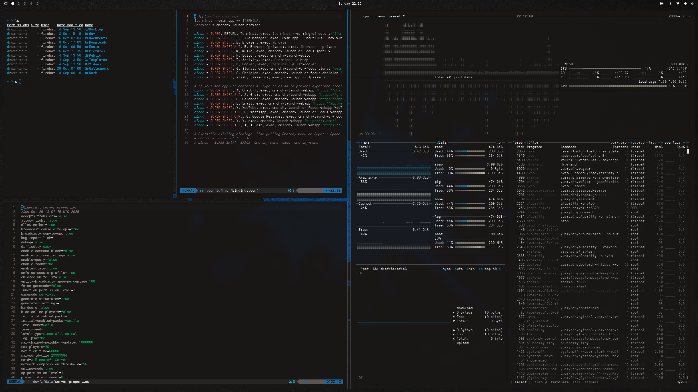
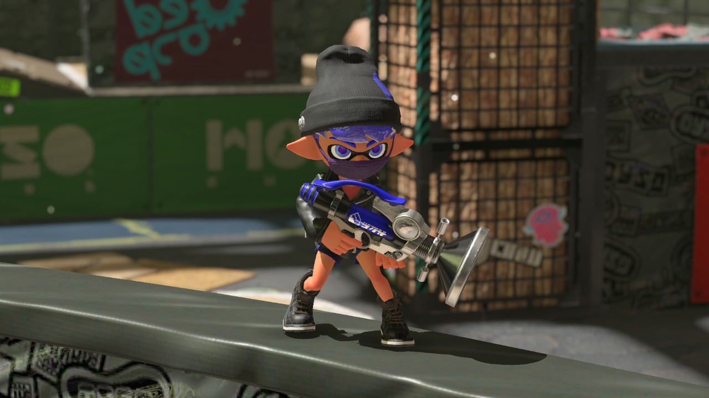

# Neo Sploosh Theme

A dark Omarchy theme inspired by the **[Neo Sploosh-o-matic](https://splatoonwiki.org/wiki/Neo_Sploosh-o-matic)** —
a short-range shooter known for its close-quarters burst and bold color accents.

- Base: `#191515`
- Accent: `#008DC9`

## Install

1. Copy the `neo-sploosh` folder into your `Omarchy/themes/` directory.
2. Set `active = "neo-sploosh"` in your config.
3. Reload Omarchy to apply the theme.
